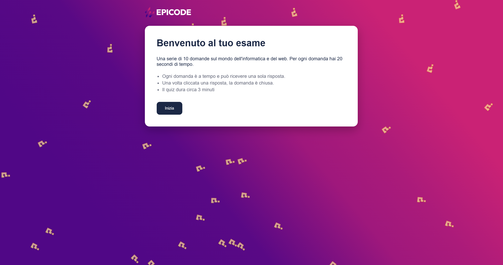
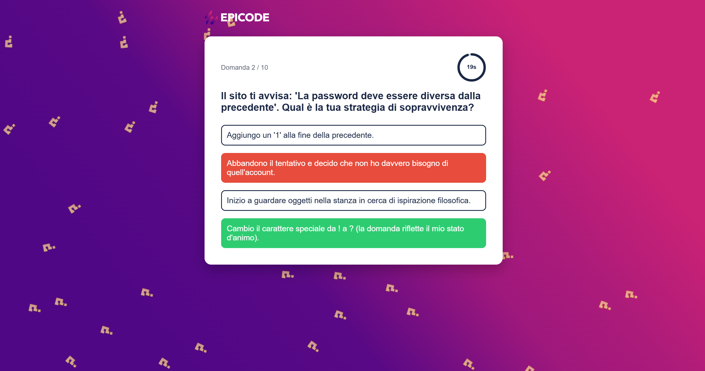
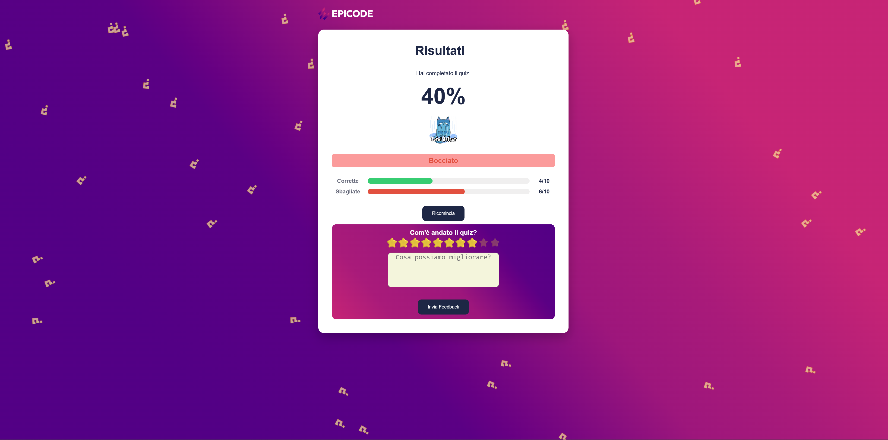

# 🧠❓💯Quiz App 

Progetto JS di gruppo basato su una pagina interattiva. Sviluppato utilizzando le conoscenze di programmazione imparate fino ad ora.

### 📒Indice


- [🧠❓💯Quiz App](#quiz-app)
    - [📒Indice](#indice)
  - [🎯Cosa fa l' applicazione?](#cosa-fa-l-applicazione)
      - [L'applicazione simula e gestisce un flusso di domande a risposta multipla.](#lapplicazione-simula-e-gestisce-un-flusso-di-domande-a-risposta-multipla)
    - [Funzionalità principali:](#funzionalità-principali)
  - [⚙️Come funziona?](#️come-funziona)
  - [💻Tecnologie utilizzate...](#tecnologie-utilizzate)
      - [🙀 Esempi](#-esempi)
  - [📸 Anteprima](#-anteprima)
  - [](#)
  - [](#-1)
  - [🔛Avvio dell' applicazione,](#avvio-dell-applicazione)
  - [📃Sitografia e fonti](#sitografia-e-fonti)
  - [🧑‍💻Autore](#autore)


## 🎯[Cosa fa l' applicazione?](#indice)

#### [L'applicazione simula e gestisce un flusso di domande a risposta multipla.](#indice)
### Funzionalità principali:
 
  **Generazione Dinamica:** 
   - A ogni avvio vengono pescate una serie di domande da un database locale, garantendo un' esperienza sempre diversa.
 
 **Gestione del Tempo e dei Feedback:**

  - Attraverso un Timer ogni domanda avrà 20 sec ma non solo, se scade il tempo, l' applicazione mostrerà la risposta corretta, considerando la mancata risposta come errata. Il Feedback è dovuto al click su una risposta, poiché l'utente vede subito se ha indovinato o sbagliato, evidenziando contemporaneamente la risposta corretta.

  **Interfaccia Fluida:** 
  - Single Page Application che gestisce all' interno di un unica pagina, senza la necessità di essere ricaricata, 3 schermate principali (Welcome, Quiz, Results).

 **Visualizzazione dei Risultati:** 
  - Schermata finale che calcola e mostra, attraverso un grafico a barre ad avanzamento dinamico, e attraverso delle percentuali, il risultato del test.

  **Effetti visivi:** 
  - Sfondo animato che genera una pioggia di elementi decorativi.

  **Effetti audio:**
  - Traccia audio che inizia quando il timer dei secondi scende a 5 e finisce quando scadono o alla selezione di una risposta


## ⚙️[Come funziona?](#indice)

Il codice è strutturato seguendo il pattern **STATO** --> **RENDER** --> **EVENTI** garantendo scalabilità e leggibilità. Dividendosi in: 

   1. **Lo Stato :** Nessuna funzione modifica direttamenete l' HTML senza prima aver aggiornato le variabile di stato( es. *currentScreen, score, currentQuestion*).
   2. **IL RENDERING :** La funzione centrale *render()* agisce come un vigile urbano: controlla lo stato attuale e decide quale schermata immettere nel DOM svuotando il contenitore principale *(#app)* dalla schermata precedente.
   3. **GLI EVENTI :** I listener *(addEventListener)* vengono agganciati via software solo dopo che la schermata è stata stampata a video.

## 💻[Tecnologie utilizzate...](#indice)

- *HTML5 :* Struttura semantica e contenitori dinamici.
- *CSS3 Avanzato :* Layout gestisti con **FLEXBOX** e **CSS Grid**. Uso di *@keyframes*, *@mousehover* etc...
- *JavaScript (Es6)*
  
#### 🙀 [Esempi](#indice)

  - Animazion segno di caduta del segno di domanda
``` 
@keyframes fall
  from {
    transform: translateY(-100vh) rotate(0deg);
  } 
  ```
-  pattern **STATO** --> **RENDER** --> **EVENTI**
```
function renderWelcome(container) {
  container.innerHTML = 
    <div class="welcome">
      <h1>Benvenuto al tuo esame</h1>
      <p>Una serie di 10 domande sul mondo dell'informatica e del web. Per ogni domanda hai 20 secondi di tempo.</p>
      
      <ul>
        <li>Ogni domanda è a tempo e può ricevere una sola risposta.</li>
        <li>Una volta cliccata una risposta, la domanda è chiusa.</li>
        <li>Il quiz dura circa 3 minuti</li>
      </ul>
      
      <button type="button" id="start-btn">Inizia</button>
    </div>
  ;
  document.getElementById("start-btn").addEventListener("click", startQuiz);
}

function startQuiz() {
  currentScreen = "quiz";
  currentQuestion = 0;
  score = 0;
  shuffledQuestions = [...QUESTIONS].sort(() => Math.random() - 0.5);
  render();
}
```
- **Timer**
```
function startTimer() {
  const timerSvg = document.getElementById("timer-display");
  timerValue = TIMER_DURATION;

  timerSvg.classList.remove("timer-red");

  const progressCircle = timerSvg.querySelector(".timer-progress");
  const textElement = timerSvg.querySelector(".timer-text");
  const circumference = 2 * Math.PI * 45; // 282.74
  progressCircle.style.strokeDashoffset = "0";
  textElement.textContent = timerValue + "s";

  if (timerId)
    clearInterval(
      timerId,
    ); }
```

## 📸 [Anteprima](#indice)

- **Welcome Page**
  ------------------
  
  ------------------
- **Quiz Page**
  ------------------
  
  ------------------
- **Results Page**
  ------------------
 

-----
## 🔛[Avvio dell' applicazione](#indice),
1. *Clonare o scaricare i file del progetto sul proprio computer.*
2. *Controllare che i file rimangano intatti  e collegati correttamente tra loro.*
3. *Avviare il file sempre in live via protocollo HTTPS, poichè aprire il file in locale può generare malfunzionamenti.*

## 📃[Sitografia e fonti](#indice)
1. *Scrittura di MARKDOWN :* https://www.markdownlang.com/it/advanced/security.html.
2. *Gestione di GitHub :* https://www.atlassian.com/it/git/tutorials/using-branches/git-merge.
3. *Animazioni :* https://stackoverflow.com/questions.
4. *Struttura del flusso :* https://developer.mozilla.org/en-US/docs/Learn/JavaScript/Building_blocks.
5. *Audio :* https://pixabay.com/sound-effects.
6. *GIF :* https://media4.giphy.com/.
7. *FavIcon :* https://www.flaticon.com/.
   
## 🧑‍💻[Autore](#indice)
- **Lorenzo Melis** https://github.com/JusTMeth25.
